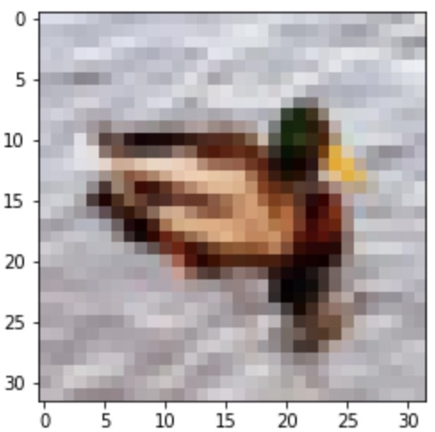

# Image classification with PyTorch

__Convolutional neural networks for image classification using the Torch library__

We construct two Convolutional Neural Networks (CNN) for image classification, using the [PyTorch](https://pytorch.org) library.

The data used comes from the widely popular [CIFAR-10](http://www.cs.toronto.edu/~kriz/cifar.html) dataset which consists of 60000 32x32 color images in 10 classes, with 6000 images per class.

---
## ConvolutionalNN_with_PyTorch.ipynb

The architecture of the networks are as follows:

### Network 1:

The first CNN consists of: 
* Two convolutional layers of size 3 with padding.
* ReLU activation and MaxPooling after each convolutional layer.
* Finally, a fully-connected Linear layer.

### Network 2:

The second CNN consists of: 
* Three convolutional layers of size 3 with padding.
* ReLU activation, MaxPooling and batch normalization after each convolutional layer.
* Three fully-connected Linear layers with ReLU activation. 